# Tameshkin-Power
Strength Measuring application for Tameshkin devices

### Home Screen:

 - 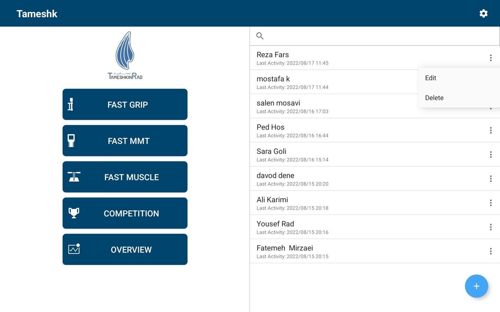

### Test Selection:

- 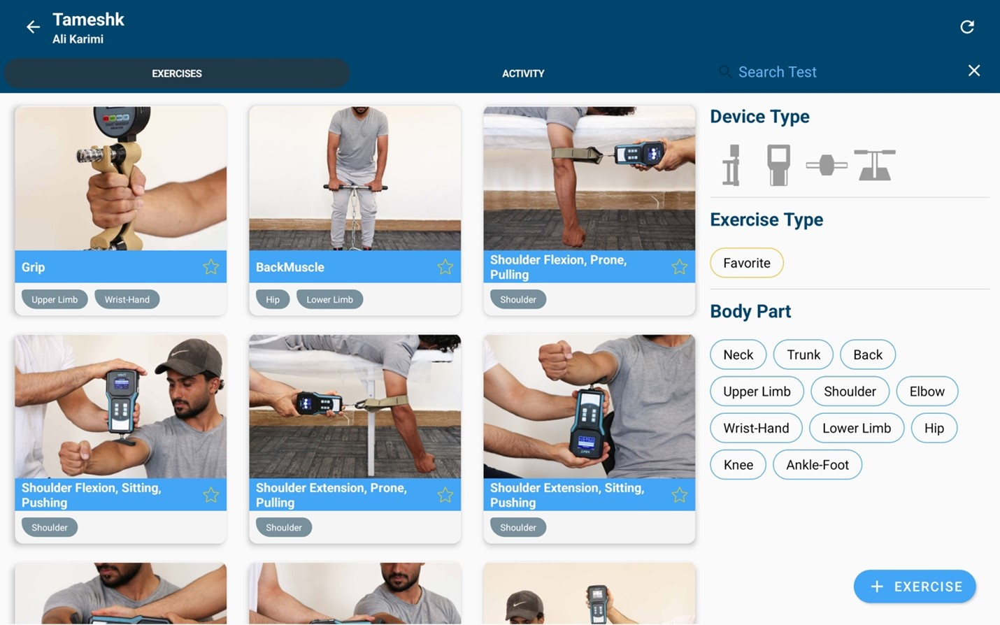

### Test Description:

- 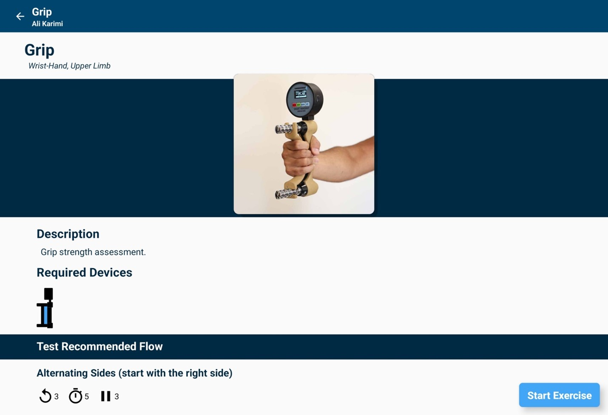

### Test Setup:

- 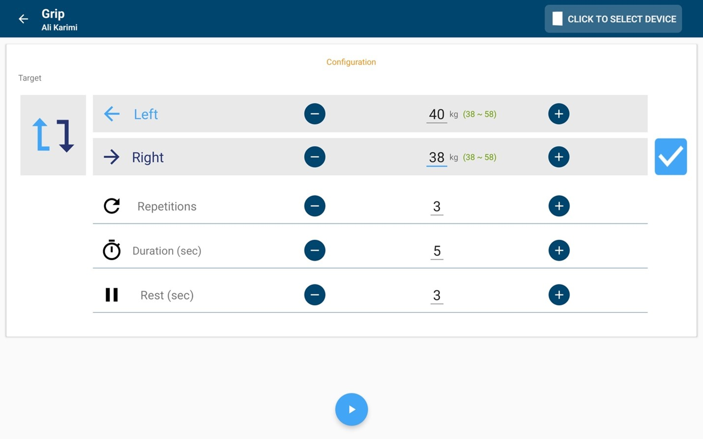

### Test Measurement Screen:

- 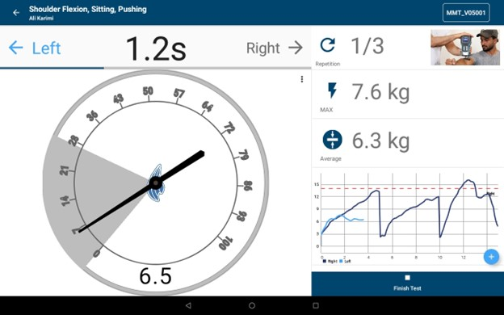

### Test Measurement Screen (different widgets):

- 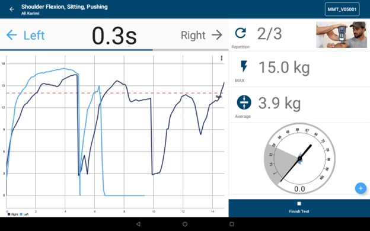

### Test Result Screen:

- 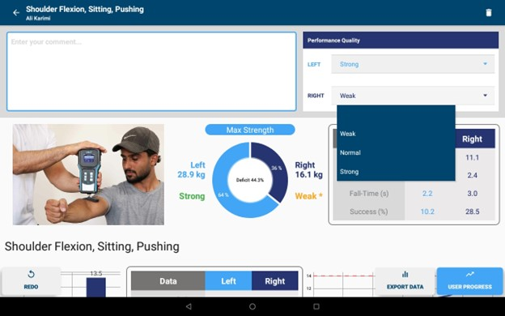

### Test Pdf report:

- 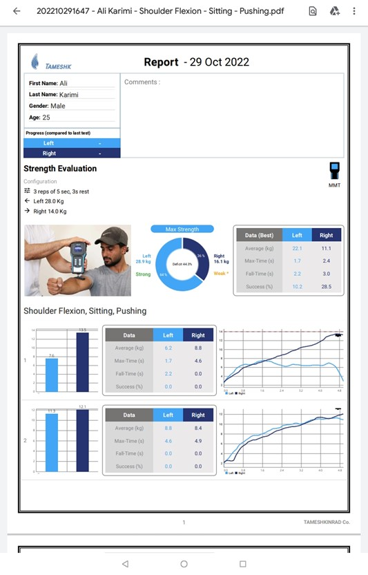

### Game/Competition Screen:

- 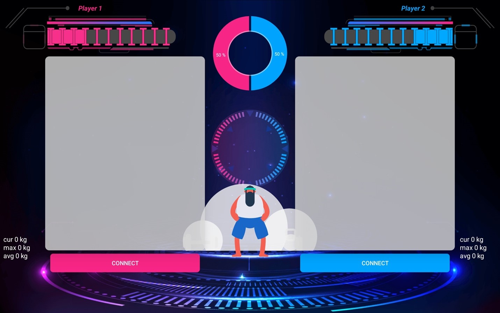
- 

### Single user progress:

- 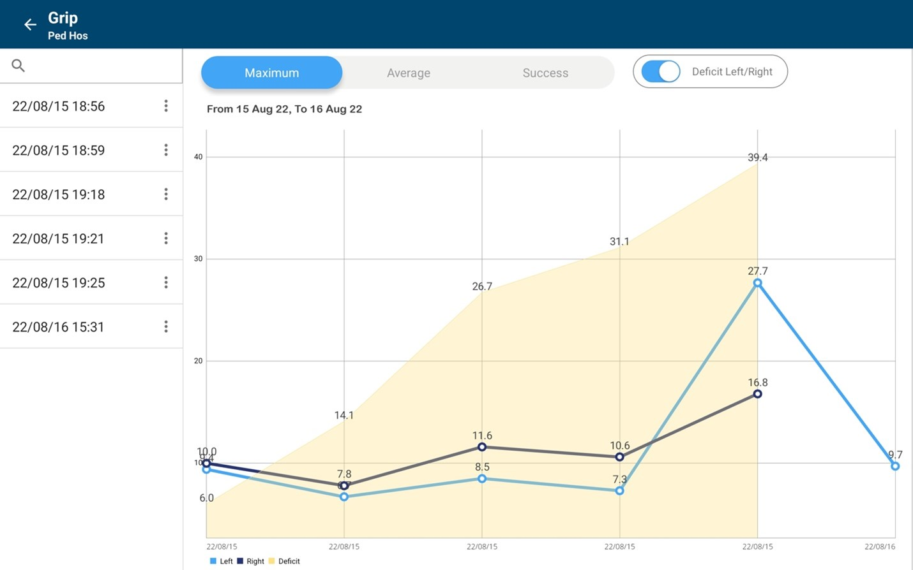

### Organization progress:

- 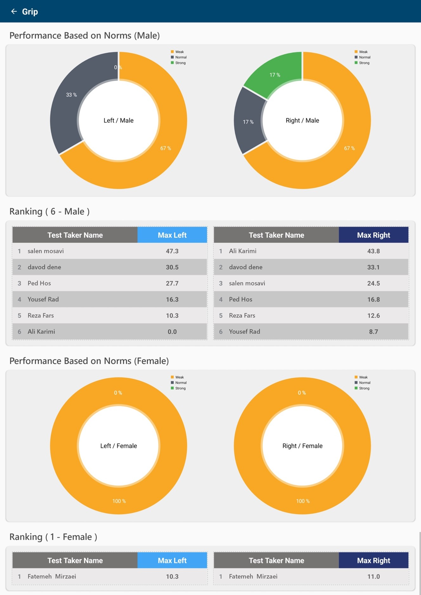

### Test Creation:

- 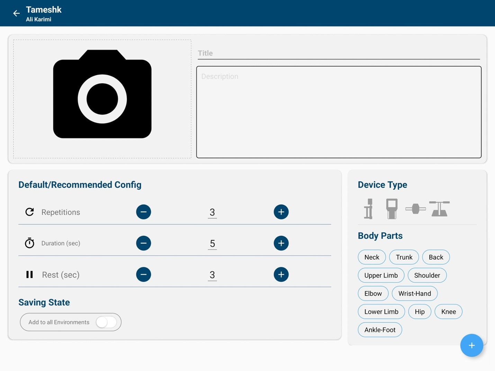

### Backup:

- 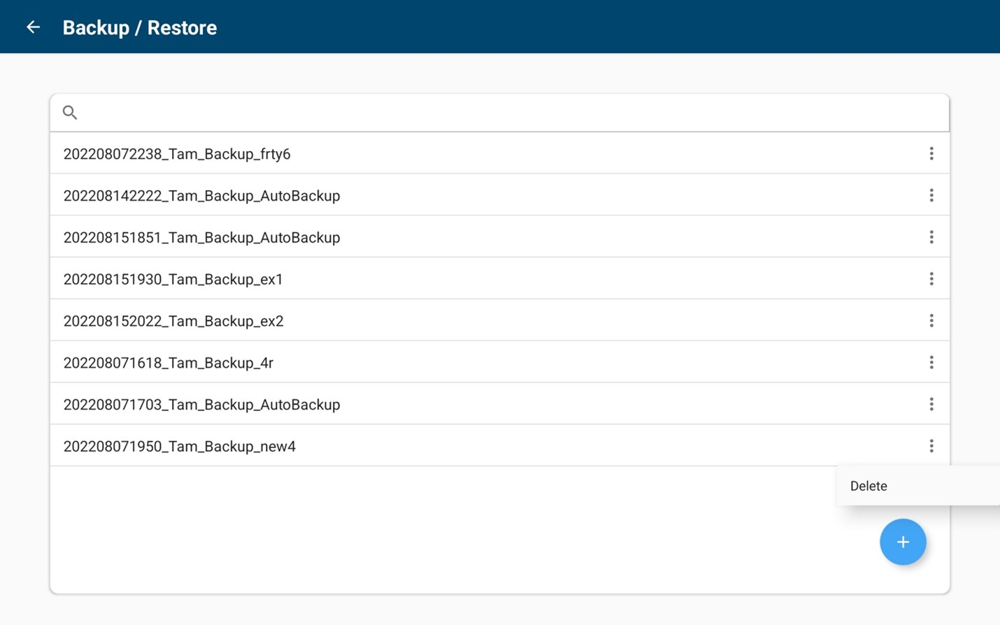

### Setting:

- 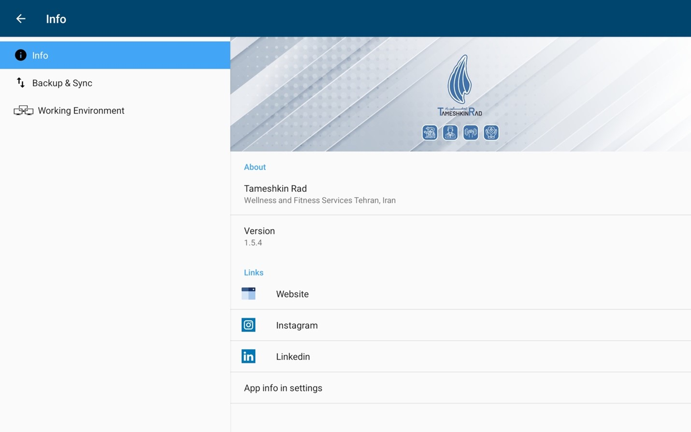

